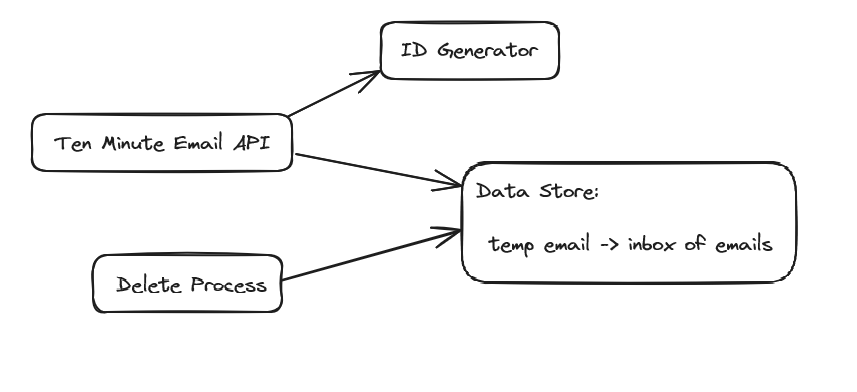

# Ten Minute Emails - Design Notes

I had three main objectives in mind while writing this:
1. Focus on scala
2. Keep things simple
3. Have fun

I have been learning the typelevel stack recently, and have adopted this style throughout.
This is mostly to keep things fun and interesting for me!

The system has four components:
1. A data store
2. An ID generator which generates email addresses
3. A service to call the two above
4. A process to delete old data from the store

## Data Store

* I decided to keep things in memory, to keep the focus on scala. I considered using a postgres container, which would have replaced some scala code with SQL and docker config.
* The data store is an immutable Map
  * Keys are temporary email addresses
  * Values are an inbox with a creation time and a list of emails
  * Adding / removing is O(1). Removing N old addresses is O(N).
* I have used the Ref type from cats effect to wrap the map and provide a mutable reference
  * Accessing and modifying the Ref is thread safe
  * I also considered using a java ConcurrentHashMap for a thread safe mutable map. This would have had two major differences:
    1. Non-functional coding style
    2. Blocked threads, where Ref will instead retry operations
* Inboxes store a vector of emails, for O(1) appending
* Errors are NOT thrown in some common scenarios (keeping it simple) - plenty of room for improvement here:
  * Adding an email to an inbox which doesn't exist will just return Unit, nothing will be saved
  * Getting emails for an inbox which doesn't exist will return an empty vector

# ID Generator

The requirements are not very restrictive:
* Two users should not generate the same address
* No restriction on user calling the API multiple times. The simplest implementation will always generate a new address (no need to incorporate the user info into the email)
* No restriction on the generated emails being ordered / sortable
* Bonus 1: human-readable - we can do easily by randomly picking from a list of words
* Bonus 2: scalable to distributed generation - we can at least ensure that the rng seed is different for each instance

For my purposes, a simple PRNG is enough. For human readability, we can choose from a list of words.
We should ensure the cardinality is high enough that collisions will be rare. I have copied a list of 100 three-letter words from a website.
We can use four of these for a cardinality of 100 million.

# Service and Deleter

* Located in the `api` package
* Api exposes three methods:
  * `createTemporaryEmail(): F[TemporaryEmail]`
  * `addEmail(key: TemporaryEmail, email: Email): F[Unit]`
  * `getEmails(key: TemporaryEmail): F[Vector[Email]]`
* Deleter exposes only a `start()` method, which will run forever and delete emails older than its run interval
* The deleter must be run parallel with the service. There are two examples of this: one in unit tests and another in the HTTP server

# Adding a Basic HTTP Server

The spec doesn't mention an HTTP server, but it feels a bit sad to not add one, so I've added a minimal http4s server.
The server is not the focus of the project, so I haven't spent much effort on it, and have omitted:
* error codes
* security
* documentation
* tests
* logging
* JSON

The API will accept the following HTTP calls on localhost:8080

* `POST /email` - create a new temporary email
* `POST /email/<temporary email prefix>` - add a new email to the inbox of this temporary email
  * request body: plain text data for the email to be added 
* `GET /email/<temporary email prefix>` - get all emails for this temporary email (as new-line separated plain text)

Data is accepted/returned in plain text.

# Usage

Run tests: `sbt test`

Run HTTP server: `sbt run`

# Misc

LoggerFactory creation is deprecated (annoying, because I used the example from their docs!), long term the correct implementation is to call Slf4jFactory[IO].create, but this would drag things on for no benefit.
